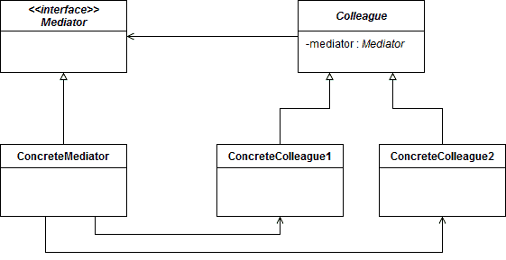
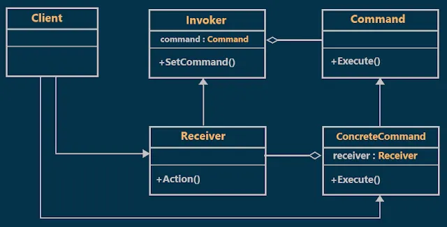

# design-patterns-dictionary

| Type           | Purpose                 | Example                      |
|----------------|-------------------------|------------------------------|
| **Creational** | How objects are created | Factory, Singleton           |
| **Structural** | How objects relate      | Adapter, Decorator, Mediator |
| **Behavior**   | How objects interact    | Command, Observer, Strategy  |

## Mediator

Mediator defines the interface the **Colleague** objects use to communicate
Colleague defines the abstract class holding a single reference to the Mediator
ConcreteMediator encapsulates the interaction logic between Colleague objects
ConcreteColleague1 and ConcreteColleague2 communicate only through the Mediator

https://www.baeldung.com/java-mediator-pattern

## Command

We have created an interface Order which is acting as a command. We have created a Stock class which acts as a request. We have concrete command classes BuyStock and SellStock implementing Order interface which will do actual command processing. A class Broker is created which acts as an invoker object. It can take and place orders.

https://www.tutorialspoint.com/design_pattern/command_pattern.htm

https://www.javacodegeeks.com/2019/09/command-design-pattern-in-java.html
